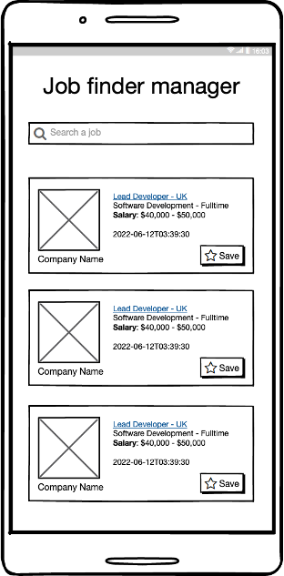
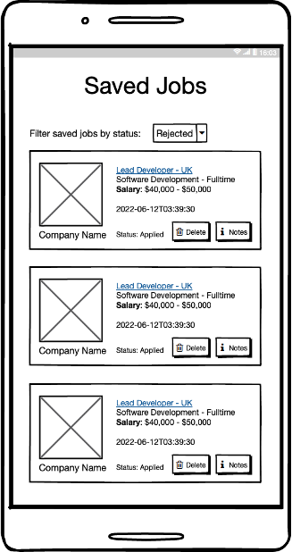
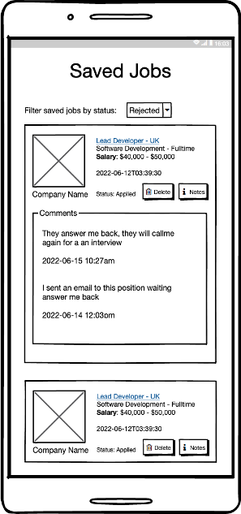
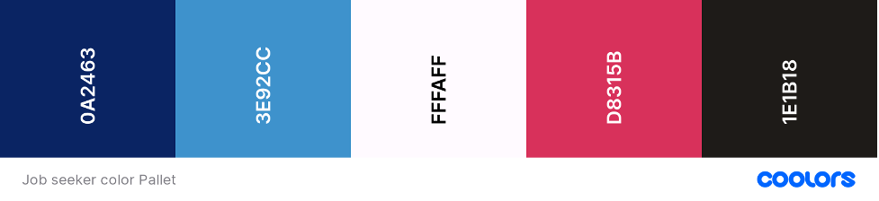

# FINAL COURSE PROJECT
## PURPOSE
Nowadays there are many portals to find employment, and there are many search engines, but it is difficult to handle all the information that interests us. For this reason, this project will serve as a tool in the search and take notes of job vacancies information.

## AUDIENCE
It is determined by people between 18 and 60 years old, with an internet connection and a web browser, who are actively looking for a job.

## DATA SOURCES
- [Remotive Jobs](https://github.com/remotive-com/remote-jobs-api) API (as job search engine)
- Localstorage (for notes and saved jobs)
## WIREFRAMES
**HOME PAGE**  
  
**SAVED JOBS**  
  
**SAVED JOB DETAILS**  
  
 	 	 
## DESIGN STYLE

### Icons:
- [CSS Astrid Icons](https://css.gg/search)

### TYPOGRAPHY:
- Roboto Slab: Titles, subtitles, emphasis.
- Poppins: Body, paragraph, etc.
 
### COLOR PALLET:

https://coolors.co/0a2463-3e92cc-fffaff-d8315b-1e1b18
## SCHEDULE
- Week 1: Design UI Kit (Mockups)
- Week 2: Implement UI (HTML & CSS)
- Week 3: Add Logic for Search Page (Use API)
- Week 4: Add Logic for Saved Jobs (Use Localstorage)
